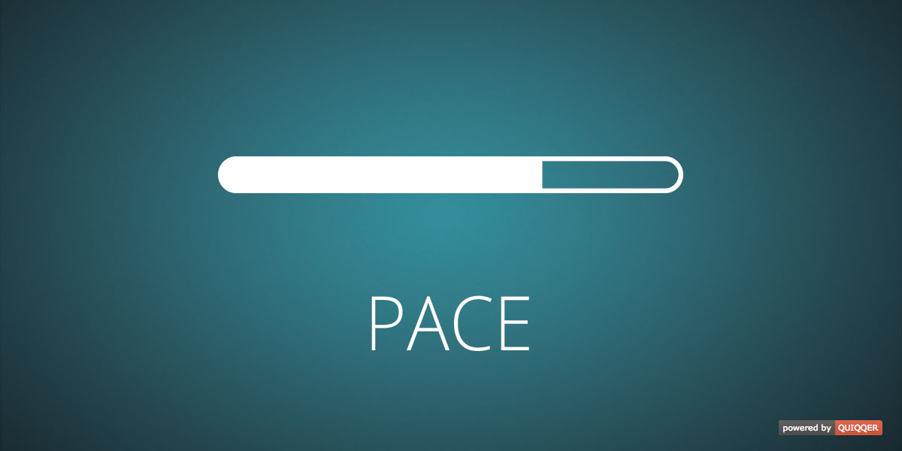

HubSpots PACE for QUIQQER
========

Adds a progress indicator for your page load and ajax navigation to your website.  
Based on [HubSpots PACE](http://github.hubspot.com/pace). 


Package name:

    quiqqer/pace


Features
--------

- page-load and ajax-navigation progress indicator 


Installation
------------

The package name is: quiqqer/pace


Contribute
----------

- Project: https://dev.quiqqer.com/quiqqer/pace
- Issue Tracker: https://dev.quiqqer.com/quiqqer/pace/issues
- Source Code: https://dev.quiqqer.com/quiqqer/pace/tree/master


Support
-------

If you found any flaws, have any wishes or suggestions you can send an email
to [support@pcsg.de](mailto:support@pcsg.de) to inform us about your concerns. 
We will try to respond to your request and forward it to the responsible developer.


License
-------

MIT


Usage
--------

Smarty:

```smarty
{pace}
{pace theme=""}
```

HTML (pace should be called as soon as possible):

```html
<!doctype html>
<html lang="{$Project->getAttribute('lang')}">
<head>
    <meta charset="utf-8"/>
    <meta name="viewport" content="user-scalable=no, width=device-width, initial-scale=1, maximum-scale=1"/>
    
    {pace}
    
    <!-- More CSS / JavaScript or QUIQQER header -->
    
</head>
```